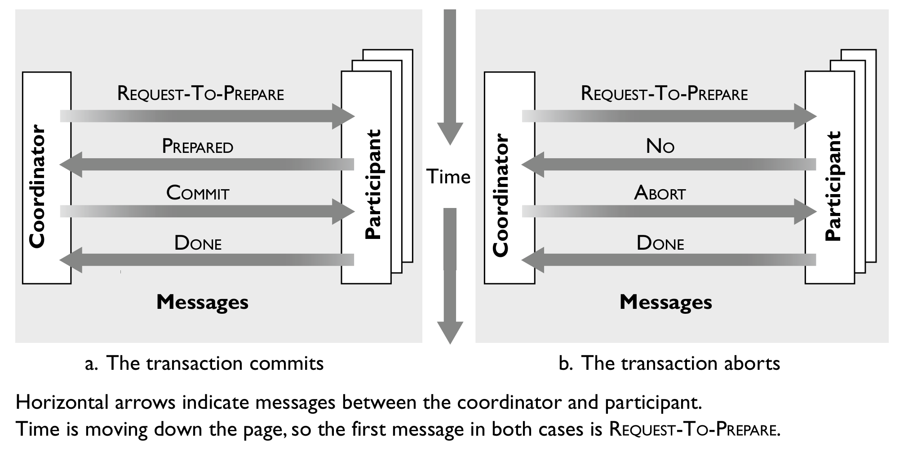

# Lab 3: A Simple Distributed Key-Value Store 

Enter in the folder you have cloned from our lab git repo, and pull the latest commit. 

`git pull`

You can find this lab3's instruction in `Lab3/README.md` 

All materials of lab3 are in folder `Lab3/`

## 1. Overview

Implement a simple distributed in-memory key-value database (KV store) by your own, using two-phase commit protocol to guarantee the consistency and robustness of your KV store.

### Goals

* Get to know the problems and difficulties in building a distributed system;
* Know how to use a simple protocol to maintain consistency between multiple distributed servers;//直到如何使用简单的协议来保持分布式系统的一致性
* Use some simple schemes to handle server failures.

## 2. Background

### 2.1 KV store键-值存储

An in-memory key-value database (also called **key-value store**, or **KV store** in this document) is a database that keeps all its data in the main memory and uses a simple key-value data structure. 

Typically, a KV-store exposes the following methods for users to store/delete/read data to/from the databases:

- **set(key, value)**: stores the value "value" with the key "key" (some KV stores also call this command as "**put**").
- **del(key)**: deletes any record associated with the key "key".
- **value=get(key)**: retrieves and returns the value associated with the key "key".

In practice, in-memory KV store serves most user requests only with data stored in the main memory, meanwhile, it often backups its data in the hard disks thus to be durable. However, in this lab, you are not required to consider the data durability (i.e., you can only store the data in main memory).  不需要考虑数据持久性

### 2.2 Distributed KV store

In large-scale cloud services, KV stores are often built in distributed manner, for the sake of **performance and robustness**.   为了性能和容错性通常是分布式的

For example, a KV store may distribute its data in multiple server machines, and simultaneously use those servers to serve user requests. As such, user requests can be evenly balanced to multiple servers when the load is high, and the database can survive from the failure of some servers.可以实现负载均衡以及在部分服务器宕机后仍可以提供服务

However, when the KV database is distributed, many problems arise. Among those problems, **consistency issue** 一致性问题may be most notorious and toughest one. For example, assume that a KV database uses two servers A and B to hold data and serve user requests. When user 1 put some key at server A, and then after a very short time user 2 and 3 each posts a get request of this key to server A and B, respectively, then how to make sure that user 2 and 3 both **get the same latest value of this key**? What is more challenging, failures can happen on servers and networks when users are posting requests.当服务器A收到一个put数据请求，但突然有两个get数据请求突然发向服务器A和B如何确保get到的数据是一样的

Next, we will introduce a very simple but classic protocol to ensure consistency among distributed database servers.

### 2.3 Two-phase commit两阶段提交协议

Now we describe possibly the simplest (but it works!) consensus protocol called **two-phase commit**, or **2PC**. This protocol can ensure the data consistency when the database is located on multiple distributed servers, that is, **two or more machines agree to do something, or not do it, atomically**. 两台及其以上的机器要么同意做，要么不同意做，原子性的Note that this is only a very short introduction. You are encouraged to search more materials if you have further questions (e.g., [this](https://www.bilibili.com/video/BV1at411y7iQ) is a good video about 2PC).

Frist, 2PC maintains a **commit log** on each machine, which keeps track of whether commit has happened. Log is used to guarantee that all machines either commit or don’t. 两阶段提交协议在每台机器上使用提交日志，用于跟踪提交是否已经发生，日志用于保证所有机器提交或不提交

Second, there is **one global coordinator**. It receives transactions from clients (e.g., set/delete/get) 有一个全局协调员，它接收来自客户端的的业务

and reply results to clients, 有一个全局协调员，它接收来自客户端的的业务并返回结果给客户端and coordinates multiple database servers, to ensure either all servers commit the transaction or all abort it.并协调多个数据库服务器，保证所有的服务器要么都提交业务要么都放弃。

Based on above architecture, 2PC operates in two distinct phases: 

1) The first phase is **prepared phase**准备阶段. The global coordinator requests that all database servers (called participants成为参与者) will promise to commit or rollback the transaction全局协调者会请求所有数据库服务器(参与者)保证提交或回滚业务 (e.g., set or delete a key) . Participants record promise in log, then acknowledge参与者会在日志中记录请求然后确认. If anyone votes to abort, coordinator writes "Abort" in its log and tells everyone to abort; each records "Abort" in log. 如果有任何一个参与者反馈终止，则协调员会将终止写入日志并通知所有参与者终止，所有参与者都会将终止写入日志

2) The second phase is **commit-or-abort phase**. After all participants respond that they are prepared, then the coordinator writes "Commit" to its log.在所有参与者响应准备好之后协调者将commit写入日志 Then the coordinator asks all participants to commit;然后协调者通知所有参与者提交 All participants respond with ACK. After receive ACKs, the coordinator writes "Got Commit" to log.所有参与者会响应ACK，在收到ACK之后协调者会将Got Commit写进日志



The detailed steps in 2PC are as follows:

***Prepared phase:*** 详细阶段说明

1)&ensp;To commit the transaction, the coordinator starts by sending a **REQUEST-TO-PREPARE** message to each participant.

为了提交业务，协调者首先发送REQUEST-TO-PREPARE消息给每个参与者

2)&ensp;The coordinator waits for all participants to "vote" on the request.

协调者等待所有参与者在请求上投票

3)&ensp;In response to receiving a **REQUEST-TO-PREPARE** message, each participant votes by sending a message back to the coordinator, as follows:

- It votes **PREPARED** if it is prepared to commit.参与者如果准备好提交则返回PREPARED
- It may vote **NO** for any reason, usually because it cannot prepare the transaction due to a local failure.参与者可能会在本地业务处理出错时返回NO
- It may delay voting indefinitely, for example, because the network drops the vote.可能会无限期的延迟提交消息，例如网络原因

***Commit-Or-Abort phase:***

1)&ensp;If the coordinator receives **PREPARED** messages from all participants, it decides to commit. The transaction is now officially committed. Otherwise, it either received a **NO** message or gave up waiting for some participant, so it decides to abort.

如果协调者从所有参与者收到PREPARED消息，则会决定提交。此时业务会被正式提交。否则协调者收到NO消息或放弃等待一些参与者，然后终止。

2)&ensp;The coordinator sends its decision to all participants (i.e.,**COMMIT** or **ABORT**).协调者将它的决定发给所有参与者

3)&ensp;Participants acknowledge receipt of the commit or abort by replying **DONE**.参与者会确认提交或终止，然后返回DONE

4)&ensp;After receiving **DONE** from all participants, the coordinator can reply clients with the transaction result 在从所有参与者收到DONE后，协调者会向客户端返回业务结果(either success or failed), and *forget* the transaction, meaning that it can deallocate any memory it was using to keep track of information about the transaction.并将所有用于追踪这一业务所存储的信息删除或释放

## 3. Your Lab Task

### 3.1 Task overview


You need to implement a simple distributed KV store. Your KV store should run as a network service on remote machine(s)你的KV存储将会运行在多台远程机器上, which can receive clients' operations on the database and return results to clients可以收到用户的数据库处理任务并将结果返回, through network messages. To cope with failures, your are required to implement your KV store services on multiple machines (which are connected with each other through network). Use 2PC protocol to maintain database consistency among multiple machines. 

To simplify the task, your KV store data is only stored in main memory只需要将数据保存在内存中. Also, the log in 2PC protocol is also only stored in main memory. 日志同样也只存储在内存中

Detailed lab requirements are discussed below.

### 3.2 KV store command formats命令格式

Your KV store servers are only required to support three database commands: `SET`, `GET` and `DEL` commands (case sensitive)只需要实现三种数据库操作. These commands (including arguments) and the return results are encapsulated into network messages using dedicated message format命令与返回结果通过专用的消息格式进行. For simplicity, all the keys and values are stored as strings in your KV store. 所有key和value均使用string

Further details are as follows:

#### 3.2.1 Network message format

In this lab, you should use a **simplified version** of RESP (REdis Serialization Protocol) message format to pass KV store commands from clients to servers (called request message)使用简化的RESP消息格式 and pass command results from server to clients (called response message) . Specifically:

##### 3.2.1.1 Client request message客户端请求消息

Clients send commands to the server using RESP Arrays (more details see `section 3.2.2`). RESP Arrays consist of 

RESP数组含有:

- A `*` character as the first byte, followed by the number of elements in the array as a decimal number, followed by CRLF.

  首先是一个*字符然后跟着1个10进制数，代表数组中的元素数，最后跟着CRLF

- Arbitrary number of bulk strings (up to 512 MB in length).任意数量的大容量字符串

The bulk string consist of:

大容量字符串含有

- A `$` byte followed by the number of bytes composing the string (a prefixed length), terminated by CRLF.

  包含有字符串的字节数的十进制数字

- The actual string data.字符串数据

- A final CRLF.末尾额CRLF

For example, the string `CS06142` is encoded as follows:

`$7\r\nCS06142\r\n`

The bulk string `$7\r\nCS06142\r\n` start with a `$` byte, and the following number 7 indicate that the length of string `CS06142` is 7. Then, the terminated CRLF, actual string data `CS06142` and the final CRLF are next, consecutively.

##### 3.2.1.2 Server response message服务器响应消息

1)&ensp;Success message: 处理成功的响应消息

Success messages are encoded in the following way: a plus '+' character, followed by a string that cannot contain a CR or LF character (no newlines are allowed), terminated by CRLF (that is "\r\n").

For example, the `SET` command reply with just "OK" on success (more details see `section 3.2.2`):

`+OK\r\n`

2)&ensp;Error message:处理错误的消息

Like success messages, error messages consist of: a minus '-' character, followed by a string, terminated by CRLF.

For example, if an error occurs, just return (more details see `section 3.2.2`):

`-ERROR\r\n` 

3)&ensp;RESP Arrays message:

Your server should return an RESP Arrays message when the `GET` command executed successfully (more detail see `section 3.2.2`).

For example:

```
*2\r\n

$5\r\n
Cloud\r\n

$9\r\n
Computing\r\n
```

`*2\r\n$5\r\nCloud\r\n$9\r\nComputing\r\n` 

4)&ensp;Integer message整数消息:

Some commands need to return an integer (e.g., `DEL` command, more details see `section 3.2.2`). An integer message is just a CRLF terminated string representing an integer, prefixed by a ":" byte.在整数前加一个前缀:

An integer message example: 

`:1\r\n`

#### 3.2.2 Database commands

##### 3.2.2.1 SET command

`SET key value`

The function of the `SET` command is to set **key** to hold the string **value**. If key already holds a value, it is overwritten. For example, if you want to set key `CS06142` to hold the string `Cloud Computing`, the command would be:

`SET CS06142 "Cloud Computing"`

According to the message format we have discussed in `section 3.2.1`, this command would be encoded as a RESP message format:

```
*4\r\n

$3\r\n
SET\r\n

$7\r\n
CS06142\r\n

$5\r\n
Cloud\r\n

$9\r\n
Computing\r\n
```

`*4\r\n$3\r\nSET\r\n$7\r\nCS06142\r\n$5\r\nCloud\r\n$9\r\nComputing\r\n`

**Note:** The encoded message start with a `*` byte. The following number 4 indicate that there are 4 bulk strings in this message. These bulk strings are `$3\r\nSET\r\n`, `$7\r\nCS06142\r\n`, `$5\r\nCloud\r\n`, and `$9\r\nComputing\r\n`. 


If the `SET` operation succeeds, the server will return a success message; otherwise, return an error message.

For example, if the `SET` operation succeeds, the server just returns:

`+OK\r\n`

Otherwise, it returns:

`-ERROR\r\n`

##### 3.2.2.2 GET command

`GET key`

`GET` command can get the **value** of **key**. If the key does not exist the special value `nil` is returned.

For example, if you want to check the value of the key `CS06142`, construct the command like this:

`GET CS06142`

Like the `GET` command, this command should be encoded as a specific message format before sending to the server. 

`*2\r\n$3\r\nGET\r\n$7\r\nCS06142\r\n`

If the `GET` command was executed correctly, the value (encoded as RESP Arrays format) of the key will be returned. 

For example, if the command above executed correctly, return:得到value后的返回值

`*2\r\n$5\r\nCloud\r\n$9\r\nComputing\r\n`

```
*2\r\n

$5\r\n
Cloud\r\n

$9\r\n
Computing\r\n
```

, assuming the value of the key `CS06142` is`Cloud Computing`.

If the key does no exist, just return://key不存在则返回nil

`*1\r\n$3\r\nnil\r\n`

If an error occurs, return an error message:发生错误则返回错误消息

`-ERROR\r\n`

##### 3.2.2.3 DEL command删除指令

`DEL key1 key2 ...`

The `DEL` command is used for removing one or more specified **keys** (arbitrary number, up to 512 MB message length). A key is ignored if it does not exist.

The `DEL` command should return the number of keys that were removed.

For example, if you want to delete key `CS06142` and key `CS162`, you can construct the `DEL` command:可删除不止一个key

`DEL CS06142 CS162`

Similar to the `SET` and `GET` commands, the `DEL` command will be encoded in RESP message as follows:

`*3\r\n$3\r\nDEL\r\n$7\r\nCS06142\r\n$5\r\nCS162\r\n`

```
*3\r\n

$3\r\n
DEL\r\n

$7\r\n
CS06142\r\n

$5\r\n
CS162\r\n
```

The server will return the number of keys that were removed.服务器会返回被删除的key数

For example, if the `DEL` command above executed, return an integer message:

`:1\r\n`

**note:** Because we only set the key `CS06142` to hold a value. As for key `CS162`, it will be ignored because it does no exist. So, the number in the integer message is 1.不存在的key会被忽略,因此只会返回被成功删除的key数

If an error occurs, return an error message:

`-ERROR\r\n`

### 3.3 Use 2PC protocol to build a KV store on multiple servers

You should implement the coordinator and participant program. 需要实现协调者代码和参与者代码

The **coordinator** does not store any data. It only receives and parses KV commands from clients, runs 2PC protocol to coordinates participants to conduct the KV commands consistently, and reply command results to clients. *There is only one coordinator in the whole system*.协调者并不保存任何数据，它只负责接收和解析来自客户端的KV指令，并运行2PC来协调参与者准确执行KV指令，最后将命令结果返回给客户端，整个系统中只有一个协调者

Each **participant** maintains a KV database in its main memory, and conduct KV commands sent from the coordinator, and return results to the coordinator. 每个参与者在内存中维持一个KV数据库，并处理来自协调者的KV指令，并将结果返回给协调者

You can use any message format for communication between the coordinator and participants. For example, you can also use the RESP format introduced before, or use some other RPC library.  在协调者和参与者之间的通信可以使用任意的消息格式

### 3.4 Run your program

#### 3.4.1 Program arguments

Enable long options to accept arguments in your program, just like lab2. There should be one and only one argument for your program: `--config_path`, which specifies the path of the configuration file. All the detailed configurations are written in the configuration file所有的配置信息都写在配置文件中. Your program should read and parse the configuration file, and run as coordinator or participant accordingly. 程序应通过读取并解析配置文件来扮演协调者或参与者

If your program is called **kvstore2pcsystem**:

run the **coordinator** process, just typing (`./src/coordinator.conf` is the coordinator's configuration file)

`./kvstore2pcsystem --config_path ./src/coordinator.conf`

run the **participant** process, just typing (`./src/participant.conf` is the participant's configuration file)

`./kvstore2pcsystem --config_path ./src/participant.conf`

When you run the command above, your program should run correctly without any further inputs.

#### 3.4.2 Configuration file format

A configuration file consists of two kinds of lines: 1) parameter line, and 2) comment line.配置文件包含两种行，参数行和注释行

- **A comment line** starts with a character '!'. The whole comment line are not parsed by the program.注释行开头用 ! 符号标记
- **A parameter line** starts with a *parameter*, followed by a *value*. The parameter and value are separated by a whitespace注释行直接以参数和值开始，中间用空格区分. Parameter lines specify the necessary information that the coordinator or participants should know before running. There are three valid parameters: `mode`, `coordinator_info`, and `participant_info`.一共有三个重要参数
  
  - The parameter `mode` specifies that whether the program runs as a coordinator or a participant. Its value should only be either `coordinator` or `participant`. `mode` line is always *the first parameter line* in the configuration file.
  
  - The parameter `coordinator_info` specifies the network address that the coordinator is listening on. Its value consists of the IP address and port number (separated by character ':'). Clients and participants can communicate with the coordinator using this network address.  Since there is only one coordinator, there is only one `coordinator_info` line in both coordinator's and participants' configuration file.
  
    协调者信息中含有它的监听地址和端口，客户端和参与者都通过此地址和端口与协调者通信，由于只会有一个协调者，所以只有一行协调者信息
  
  - The parameter `participant_info` consists of the network address that participant process is listening on. Its value consists of the IP address and port number (separated by character ':'). The coordinator can communicate with the participant using this network address. For participants, there is only one `participant_info` line in the configuration file, specifying its own network address; For the coordinator, there can be multiple `participant_info` lines in the configuration file, specifying the network addresses of all participants.
  
    参与者信息中含有参与者所监听的地址和端口，每个参与者自己的配置文件中只会有一行参与者信息也就是自己监听的地址和端口，而协调者的配置文件中会有多个参与者的地址和端口

Sample coordinator configuration file:协调者配置文件示例

```
!
! Coordinator configuration
!      2020/05/07 11:25:33
!
! The argument name and value are separated by whitespace in the configuration file.
!
! Mode of process, coordinator OR participant
mode coordinator
!
! The address and port the coordinator process is listening on.
! Note that the address and port are separated by character ':'. 
coordinator_info 127.0.0.1:8001
!
! Address and port information of all participants. 
! Three lines specifies three participants' addresses.
participant_info 127.0.0.1:8002 
participant_info 127.0.0.1:8003 
participant_info 127.0.0.1:8004
```

Sample participant configuration file:

```
!
! Participant configuration
!      2020/05/07 11:25:33
!
! The argument name and value are separated by whitespace in the configuration file.
!
! Mode of process, coordinator OR participant
mode participant
!
! The address and port the participant process is listening on.
participant_info 127.0.0.1:8002
!
! The address and port the coordinator process is listening on.
coordinator_info 127.0.0.1:8001
```

### 3.5 Implementation requirements

#### 3.5.1 Basic version

Your program should complete all the tasks described in `section 3.1-3.4`. Your system is required to correctly receive and conduct the KV commands, and reply the corresponding results, as described before. 系统可以正常收发KV指令并返回结果

In the basic version, there will be **no participant failures**. Also, we will **not inject any network failures**. However, the network may still drop packets occasionally. You can use TCP to handle such occasional drops. 在基础版本中将不会有参与者出错，且不会有任何网络错误，可以使用TCP防止分组丢失，

**The coordinator process may be killed and restart at any time for multiple times**. So do not store any database data in the coordinator. The coordinator will deal with clients' KV commands when it is working. When the coordinator is killed, your system is not required to reply any client's commands. Clients will keep retransmit its KV commands until it gets success response from the coordinator. The coordinator remembers no history (except for the information in the configuration file), so it will deal with all commands as new ones after it restarts.协调者进程可能会多次在任何时候被杀死和重启，协调者不会保存任何信息。协调者只会在运行时处理KV指令，在非运行时不会对任何客户端请求作出回应，而客户端会不断地执行重传直到得到正确回应。所以它会在重启后将客户端请求视为新的

Your program should run correctly with 3 or more participants.

#### 3.5.2 Advanced version

Your program should complete all the tasks described in `section 3.1-3.4`. Your system is required to correctly receive and conduct the KV commands, and reply the corresponding results, as described before.  

In the advanced version, **participants may fail, and the network links may fail**. However, the participant and network link **failures are one-shot**, that is, if they fail, they will never come back again. Also, **the coordinator process may be killed and restart at any time for multiple times**. The coordinator will deal with clients' KV commands when it is working. When the coordinator is killed, your system is not required to reply any client's commands. 在高级版本中参与者可能会宕机，且网络可能会中断。但是这里的参与者宕机不会恢复。协调者可能会在任何时间被杀死多次。协调者被杀死后不需要回复任何客户端请求。

When the coordinator is working, it should be able to detect the failure of participants. You can use some periodical heartbeat messages to detect the participant failure (e.g., no reply after certain number of heartbeats). **Once a participant is dead, the coordinator should be able to remove it from the system, and correctly receive/conduct/reply clients' KV commands with the rest participants**. If all participants fail, the coordinator will always reply ERROR to the clients' KV commands. The coordinator remembers no history (except for the information in the configuration file), so it need to redetect all the participants' liveness after restart.协调者在运行时需要探测参与者的错误，可以使用心跳机制。在一个参与者宕机之后应当将其从系统中移除，并通过剩下的参与者处理客户端的KV请求。在所有参与者宕机之后协调者只会向客户端返回ERROR。协调者不记录任何历史。

Your program should run correctly with 3 or more participants.

**NOTE**: **Groups that have registered for demo 3 should at least finish the advanced version.** 

#### **3.5.3 Extreme version**

Your program should complete all the tasks described in `section 3.1-3.4`. Your system is required to correctly receive and conduct the KV commands, and reply the corresponding results, as described before.  

In the extreme version, **participants may fail, and the network links may fail**. The participant and network link **failures can be both permanent or transient**, that is, if they fail, they may come back again at any time. Also, **the coordinator process may be killed and restart at any time for multiple times**. The coordinator will deal with clients' KV commands when it is working. When the coordinator is killed, your system is not required to reply any client's commands. 在这个版本中，所有的参与者与网络可能发生永久或暂时错误

When the coordinator is working, it should be able to detect **both failure and recovery** of participants. Once a participant is dead, the coordinator should be able to remove it from the system; Once a participant is recovered, the coordinator should be able to add it back to the system. Note that to keep database consistent, after a participant recovers from failure, you should copy the latest KV store database from some working participants to this recovered participant. We will not provide any copy protocols for you. You are encouraged to devise your own schemes as long as it is correct. You should be very careful about the consistency issue since the failures can be very complex and random. For example, considering the case that there are two participants A and B, A fails first and then A comes back and B fails later. During this procedure, client's may keep sending KV commands, so A needs to sync those new KV commands after coming back, otherwise it cannot server client's request correctly after B fails. 

We will randomly inject failure and recovery to all the participants and network links. To ensure the database can be successfully copied, during our test, after a participant (or its network link) is recovered from failure, we will ensure that *no failures happen in the following 10 seconds* (no coordinator/participant/network failure). Your coordinator should be able to copy the latest database to the newly recovered participant in this 10 seconds. Moreover, we will always ensure that *there is at least one working participant* in the system. As such, the coordinator should be able to correctly receive/conduct/reply clients' KV commands during the failures and recoveries.

Your program should run correctly with 3 or more participants.

**NOTE**: **Groups that have registered for demo 4 should at least finish the extreme version.** 

#### **3.5.6 Ultimate version**

Since the coordinator may permanently fail, your system should also **be able to deal with clients' requests even when coordinator fails**. 2PC is not able to handle this problem. So in this version, you will not use 2PC protocol, but use some advanced consensus protocol to handle this case. 

You can implement multiple KV store servers, where each server can receive requests from clients, stores data, and reply responses. Clients are preconfigured with all servers' addresses, and may send KV commands to any of the server, randomly. To keep consistency, normally there is only one leader server that deal with all the clients' requests, and backup the data in other servers. Clients' commands to other servers are all redirected to the leader. The consensus protocol can help servers to detect the failure of the leader server, and reelect a new leader. Also, the consensus protocol can help to maintain database consistency among multiple servers.

[Raft](https://raft.github.io/) is a very good consensus protocol for this purpose. You may want to read its paper by yourself and use raft to implement this version (there are many open-sourced raft implementation that you can borrow). Sorry I'm not going to teach you this :) Of course, it is always good to use other consensus protocols or even your own schemes.

**NOTE**: **This version is very difficult, so it is not compulsory but just a challenge. Have fun!**

## 4. Lab submission

Please put all your code in folder `Lab3` and write a `Makefile` so that we **can compile your code in one single command** `make`. The compiled runnable executable binary should be named `kvstore2pcsystem` and located in folder `Lab3`. Please carefully following above rules so that TAs can automatically test your code!!!

You can use any available code or library for this lab. Please search the Internet. However, do not copy other teams' code. No performance test report is required for this lab. Enjoy the lab :)

Please submit your lab program following the guidance in the [Overall Lab Instructions](../README.md) (`../README.md`)

## 5. Grading standards

1. You can get 13 points if you can finish all the requirements of the basic version. If you missed some parts, you will get part of the points depending how much you finished.
2. You can get 21 points if you can finish all the requirements of the advanced version. If you missed some parts, you will get part of the points depending how much you finished.
3. You can get 24 points if you can finish all the requirements of the extreme version. If you missed some parts, you will get part of the points depending how much you finished.
4. You can get 25 points if you can finish all the requirements of the ultimate version. If you missed some parts, you will get part of the points depending how much you finished.